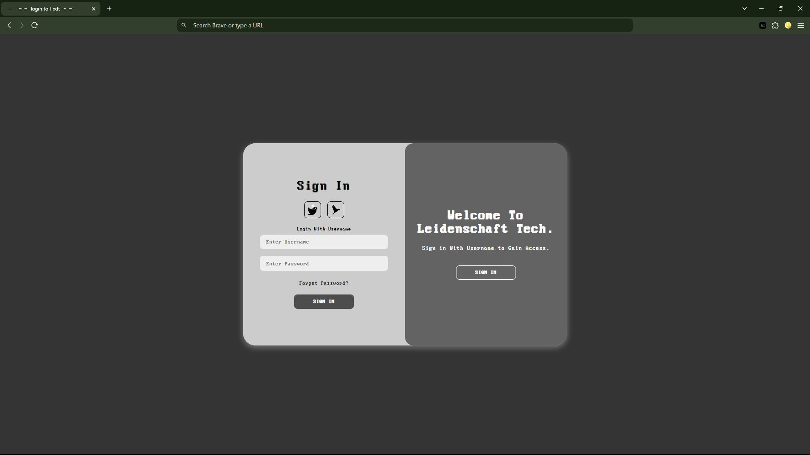
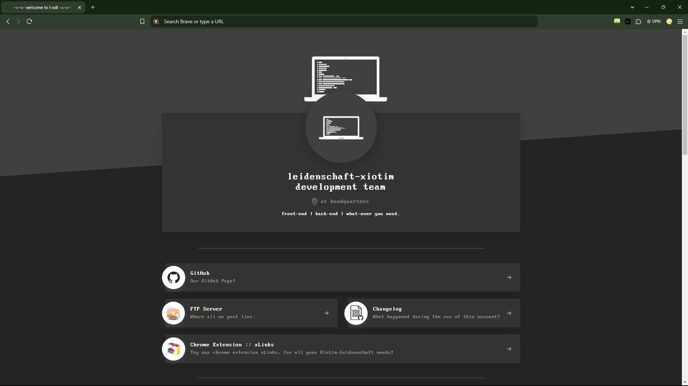
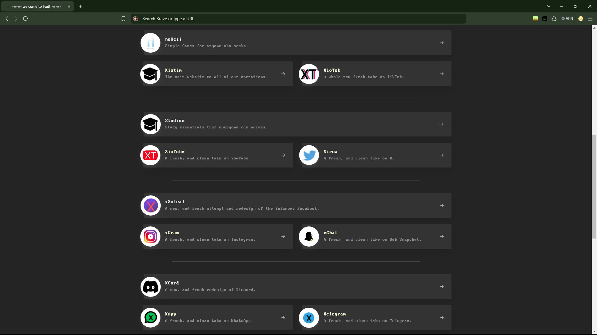
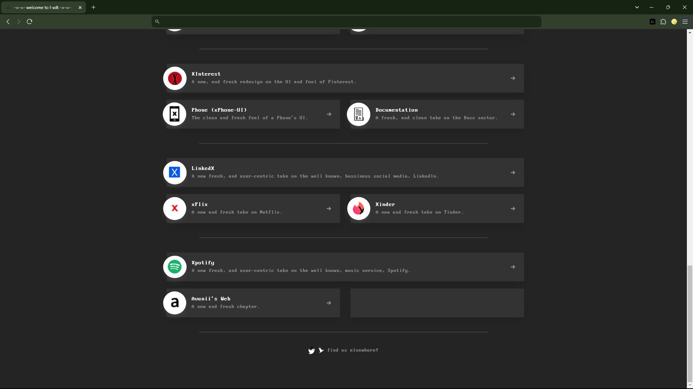

# Main Website

This is the Main website for the L-XDT GitHub to express all the websites and also link them in unison and harmony.

The assets can be found: [here](https://solo.to/)

**(Thanks to solo.to for the Main Website HTML!)**


## Acknowledgements

 - Made by: [Alvin Maranx, II ツ (Avun)](https://github.com/avunii/)
 
 - Huge shoutout to my 2nd last official project (at the time of writing this): [FTP (x-FTP)](https://github.com/l-xdt/ftp/)

 - A huge help in this project: [DiffChecker](https://www.diffchecker.com/)


## Authors

- [LeidenSchaft-Xiotim Development Team](https://www.github.com/l-xdt)

- [Alvin Maranx, II ツ (Avun)](https://www.github.com/avunii)

- [solo.to](https://solo.to)


## Demo

This is not the Demo, just how you acess it: [here](https://l-xdt.github.io).


## Features

- Made for dark Mode.

- Custom fonts.

- Fullscreen mode.

- Covers most of our GitHub code.

- Cross platform (for most browsers).

- **PS:** There are a set amount of features for this project so you have to discover more on your own.


## Screenshots









**Written in Vanilla/Plain HTML, CSS and JavaScript.**


## Run Locally

Clone the project, modify it and run it using XAMPP.

```bash
  git clone https://github.com/l-xdt/l-xdt.github.io/
```

Go to the project directory

```bash
  cd l-xdt.github.io
```

Install XAMPP (via Chocalatey, if you don't have it.)

```bash
  chocalatey install xampp
```

Start the server

```bash
  [Directory]/[ServerName]/apache-start.bat
```


## Roadmap

- Additional browser support

- Change the HTML.

- Personalise the code.

- Add your websites.

- Add something new.

- Change the FavIcon (of-course) inspired by our Signature: **X**

- **Written in Vanilla HTML, CSS and Javascript**


## Support

For support, emails: [this one](mailto:trowesigames@gmail.com) or [this one](mailto:leidenschaft.tech@hotmail.com) or join our Discord Server: which is not up as of writing this.


## Feedback

This still applies to feedback aswell, Whether you want to give us postive words or neative words, send away (put please only send constructive critisism).

Send away: [here](mailto:trowesigames@gmail.com) or [here](mailto:leidenschaft.tech@hotmail.com).


## FAQ

**Now for the official last time, my favourite part FAQ!**

#### Can I modify this to fit my needs?

Yeah, sure! That is why we make repositories like these public, for you to tinker and try new things while learning.

#### Can I host this? If I can how?

You can! With my favourite Apache Container, XAMPP. since this is the last (official) repository here is a quick summary:

So, Apache uses 127.0.0.1 which leads back every Windows and Linux, (and some configured macOS) machines, back to itself to host websites, and XAMPP gives it a GUI (Graphical Interface)

Here is a [download](https://www.apachefriends.org/download.html) to it. And if you are struggling with it here is a [tutorial](https://www.youtube.com/watch?v=LzucEZh4_no) (by MainlyWebStuff); and for the novices here is a tutorial on how to self-host a domain: [here](https://www.youtube.com/watch?v=_eQGAJVtRCs) (by Soeng Souy).


## Used By

This project is used by the following companies:

- LeidenSchaft-Xiotim Accquisitions (Limited)

- XDT-Studium.

- Xiotim Development Team [Limited] (XDT).

- XDT-noHesi.


## Related

Here are some related projects (in order of release date):

- [Main Website - This project](https://github.com/l-xdt/l-xdt.github.io/)

- [FTP (x-FTP)](https://github.com/l-xdt/ftp/)

- [L-XDT](https://github.com/l-xdt/l-xdt/)

- [Documentation (x-Doc)](https://github.com/l-xdt/documentation/)

- [Phone (xPhone-UI)](https://github.com/l-xdt/phone/)

- [xLinks](https://github.com/l-xdt/xlinks/)

- [XInterest](https://github.com/l-xdt/xinterest/)

- [Xelegram](https://github.com/l-xdt/xelegram/)

- [XApp](https://github.com/l-xdt/xapp/)

- [XCord](https://github.com/l-xdt/xcord/)

- [XChat](https://github.com/l-xdt/xchat/)

- [XGram](https://github.com/l-xdt/xgram/)

- [xSocial](https://github.com/l-xdt/xSocial/)

- [Xirox](https://github.com/l-xdt/xirox/)

- [XioTube](https://github.com/l-xdt/xiotube/)

- [Studium](https://github.com/l-xdt/studium/)

- [XioTok](https://github.com/l-xdt/xiotok/)

- [XioTim](https://github.com/l-xdt/xiotim/)

- [no-Hesi](https://github.com/l-xdt/no-hesi/)


## Documentation

- This project doesn't really have any good documentation, just a normal understanding of HTML and CSS to understand, (knowing JavaScript is optional, but would be a upperhand).

- But here is the website I took this from, [solo.to](https://solo.to), the website itself.


## API Reference

There are no APIs known of, this project only consists of Vanilla HTML, CSS, Javascript, and images. No frameworks, if there is, I will update this readMe.

